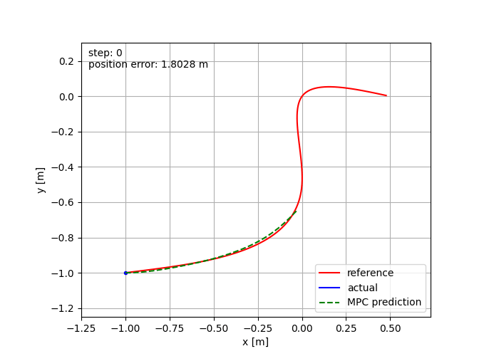

# Differential-wheeled-robot-MPC-tracking

## Visualization

### NMPC



> Note: new generated figures, animations, and run logs are written to `assets/` by default.

The enhanced demo can generate:

- `assets/images/test.gif`: NMPC tracking animation with reference path, executed path, robot heading, current MPC prediction horizon, and step information.
- `assets/images/control_profile.png`: linear/angular velocity profile.
- `assets/images/tracking_error.png`: position tracking error curve.
- `assets/logs/demo_tracking.csv`: CSV log containing state, control, and error at each step.

## Quick Start

This repository contains a nonlinear MPC demo for differential-wheeled robot trajectory tracking.

### 1. Clone the repository

```bash
git clone https://github.com/zhujiwei0101/Differential-wheeled-robot-MPC-tracking.git
cd Differential-wheeled-robot-MPC-tracking
```

### 2. Install dependencies with uv

This project supports `uv sync` through `pyproject.toml`:

```bash
uv sync
```

Then run the enhanced demo with:

```bash
uv run python src/demo_tracking.py
```

You can customize output paths and optionally show a static plot:

```bash
uv run python src/demo_tracking.py \
  --output assets/images/test.gif \
  --control-plot assets/images/control_profile.png \
  --error-plot assets/images/tracking_error.png \
  --log assets/logs/demo_tracking.csv \
  --show-plot
```

If you prefer to create a specific Python version environment:

```bash
uv venv --python 3.10
uv sync
uv run python src/demo_tracking.py
```

### 3. Alternative: install dependencies with pip

```bash
python -m venv .venv
source .venv/bin/activate
pip install -r requirements.txt
python src/demo_tracking.py
```

The main dependencies are:

- `casadi`: nonlinear optimization and IPOPT solver interface
- `numpy`: numerical computation
- `matplotlib`: trajectory plotting and animation
- `pillow`: GIF writer used by Matplotlib animation

For backward compatibility, this also works:

```bash
uv run python src/mpc.py
```

The script runs an NMPC tracking example from the initial state `[-1, -1, 0]` to the target state `[0.5, 0, 0]`.

### 4. Optional: test the spline planner

```bash
uv run python src/cubic_spline_planner.py
```

This runs the built-in 2D cubic spline example and displays the generated spline path, yaw, and curvature plots.

## Repository Structure

```text
.
├── README.md                   # Project description, running instructions, and MPC derivation
├── pyproject.toml              # uv project configuration
├── requirements.txt            # Python dependencies for pip users
├── .gitignore                  # Ignore Python caches and generated outputs
├── src/                        # Source code
│   ├── demo_tracking.py        # Runnable NMPC tracking demo
│   ├── mpc.py                  # Backward-compatible demo entry point
│   ├── mpc_controller.py       # Reusable NMPC controller
│   ├── visualization.py        # Plotting and GIF utilities
│   └── cubic_spline_planner.py # 2D cubic spline path generation utility
├── assets/                     # Non-code assets
│   ├── README.md               # Asset directory notes
│   ├── logs/                   # Generated CSV run logs
│   │   └── .gitkeep
│   └── images/                 # Generated figures and GIFs
│       └── .gitkeep
└── test.gif                    # Existing historical NMPC visualization
```

## Implementation Notes

The optimized controller builds the CasADi/IPOPT solver once when `MPCController` is initialized. During the control loop, each step only updates the current state, reference window, and warm-start guesses. This avoids rebuilding the optimization graph at every MPC iteration.

The enhanced animation shows the current MPC prediction horizon at every frame, which helps illustrate the receding-horizon control process: the controller predicts multiple future steps but only executes the first control action.

The control cost matrix is also changed to a diagonal form:

```math
R = \mathrm{diag}(0.5, 0.05)
```

which separately penalizes linear velocity and angular velocity.

## Preliminaries

### Kinematics Model
The kinematics model of WMR is 
```math
\left\{
\begin{aligned}
\dot x & =  v\cos\theta \\
\dot y & =  v\sin\theta \\
\dot\theta & =  \omega
\end{aligned}
\right.
```
or
```math
\boldsymbol{\dot x} = f(\boldsymbol{x}, \boldsymbol{u})
```
where $\boldsymbol{x} = [x,y,\theta]^\top$ and $\boldsymbol{u} = [v,\omega]^\top$.
Consider a sampling period $T$ , a sampling instant $k$, a corresponding discrete-time representation is
```math
\left\{
\begin{aligned}
x({k+1}) &= x(k) + T v(k) \cos\theta(k)\\
y({k+1}) &= y(k) + T v(k) \sin\theta(k)\\
\theta(k+1) &= \theta(k) + T\omega(k)
\end{aligned}
\right.
```
or
```math
\boldsymbol{x}(k+1) = f_d(\boldsymbol{x}(k), \boldsymbol{u}(k))
```
The prediction of the robot motion is obtained as follows:
```math
\boldsymbol{x}(k+j+1|k) = f_d(\boldsymbol{x}(k+j|k), \boldsymbol{u}(k+j|k))
```
where $j\in[0, N-1]$ and $N$ is the prediction horizon, $\boldsymbol{x}(k+j+1|k)$ means the $k+j+1$ prediction value predicted at the instant $k$.
The WMR is expected to track a reference trajectory $\boldsymbol{x_r}$ and find a control law such that
```math
\boldsymbol{x}(k) - \boldsymbol{x}_r(k) = 0
```
The reference robot model is considered to be identical to the actual robot to be controlled. That is
```math
\boldsymbol{x}_r(k+1) = f_d(\boldsymbol{x}_r(k), \boldsymbol{u}_r(k))
```
### Linearization
To reduce the computational effort, a linearization approach is used to simplify the non-linear system, which is linearized around reference trajectory by
```math
\boldsymbol{\dot x} = f(\boldsymbol{x}_r, \boldsymbol{u}_r) + f_{\boldsymbol{x},r}(\boldsymbol{x}- \boldsymbol{x}_r) +f_{\boldsymbol{u},r}(\boldsymbol{u}- \boldsymbol{u}_r)
```
where $f_{\boldsymbol{x},r}$ and $f_{\boldsymbol{u},r}$ are the jacobians of $f$ evaluated around the reference point.

Let $\boldsymbol{\tilde x } =\boldsymbol{x} - \boldsymbol{x}_r$ and $\boldsymbol{\tilde u } =\boldsymbol{u} - \boldsymbol{u}_r$ represent the error, then
```math
\boldsymbol{\dot{\tilde x}} = f_{\boldsymbol{x},r}\boldsymbol{\tilde x} +f_{\boldsymbol{u},r}\boldsymbol{\tilde u}
```
the discrete-time system model is
```math
\boldsymbol{{\tilde x}}(k+1) = \boldsymbol{A}(k)\boldsymbol{\tilde x} +\boldsymbol{B}(k)\boldsymbol{\tilde u}
```
with 
```math
\boldsymbol{A}(k) = 
\begin{bmatrix}
1 & 0 & -v_r(k)\sin\theta_r(k)T\\
0 & 1 & -v_r(k)\cos\theta_r(k)T \\
0 & 0 & 1
\end{bmatrix}
```
```math
\boldsymbol{B}(k) = 
\begin{bmatrix}
\cos\theta_r(k)T & 0\\
\sin\theta_r(k)T & 0\\
0 & T
\end{bmatrix}
```
### MPC control
MPC is an optimal control strategy that uses the model of the system to obtain an optimal control sequence by minimizing an objective function. 
```math
X(k+1) = 
\begin{bmatrix}
\boldsymbol{\tilde x}(k+1|k)\\
\boldsymbol{\tilde x}(k+2|k)\\
\vdots\\
\boldsymbol{\tilde x}(k+N|k)
\end{bmatrix}, 
U(k) = 
\begin{bmatrix}
\boldsymbol{\tilde u}(k|k)\\
\boldsymbol{\tilde u}(k+1|k)\\
\vdots\\
\boldsymbol{\tilde u}(k+N-1|k)
\end{bmatrix}
```
The cost function can be written as:
```math
J(k) = X(k+1)^\top Q X(k+1) + U(k)^\top R U(k)
```
where $Q = \mathrm{diag}(q;..;q)$ and $R= \mathrm{diag}(r;..;r)$. 
```math
X(k+1) = \bar A(k)\boldsymbol{\tilde x}(k|k)+\bar B (k)U(k)
```
where $\bar A$ and $\bar B$ are
```math
\bar A(k) = 
\begin{bmatrix}
\boldsymbol A(k|k)\\
\Pi_{i=0}^1\boldsymbol A(k+i|k)\\
\vdots\\
\Pi_{i=0}^{N-1}\boldsymbol A(k+i|k)
\end{bmatrix}\\ \quad
\\
\bar B(k) = 
\begin{bmatrix}
\boldsymbol B(k|k)& 0 & \cdots & 0\\
\boldsymbol B(k|k)\Pi_{i=0}^1\boldsymbol A(k+i|k)& \boldsymbol B(k+1|k) &\cdots & 0\\
\vdots & \vdots & \ddots & 0\\
\boldsymbol B(k|k)\Pi_{i=0}^{N-1}\boldsymbol A(k+i|k) & \boldsymbol B(k+1|k)\Pi_{i=0}^{N-2}\boldsymbol A(k+i|k) & \cdots & \boldsymbol B(k+N-1|k)
\end{bmatrix}
```
And we can rewrite the cost function in a standard quadratic form:
```math
J(k) = \frac12 U^\top(k)H(k)U(k)+E^\top(k)U(k)+G(k)
```
with
```math
\begin{aligned}
H(k) &= 2(\bar B^\top(k)Q\bar B(k) + R)\\
E(k) &= 2\bar B^\top(k)Q\bar A(k)\tilde x(k|k)\\
G(k) &= \tilde x ^\top(k|k) \bar A^\top(k)Q \bar A(k)\tilde x (k|k)
\end{aligned}
```
since $G$ is independet of $\boldsymbol{\tilde u}$, the cost function can be written as 
```math
J(k) = \frac12 U^\top(k)H(k)U(k)+E^\top(k)U(k)
```
The optimization problem to be solved at each sampling time is stated as follows:
```math
\begin{aligned}
\boldsymbol{\tilde u}^* &= {\mathrm{argmin}}_{\boldsymbol{\tilde u}} J(k) \\
s.t \quad \boldsymbol u_{min} - \boldsymbol{u}_r(k+j) \leq &\boldsymbol{\tilde u}(k+j|k)\leq \boldsymbol u_{max} - \boldsymbol{u}_r(k+j), j\in [0, N-1]
\end{aligned}
```
